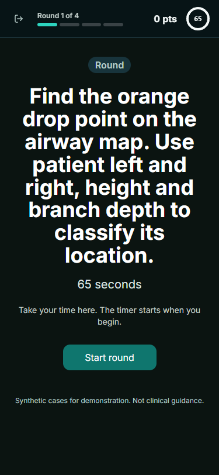
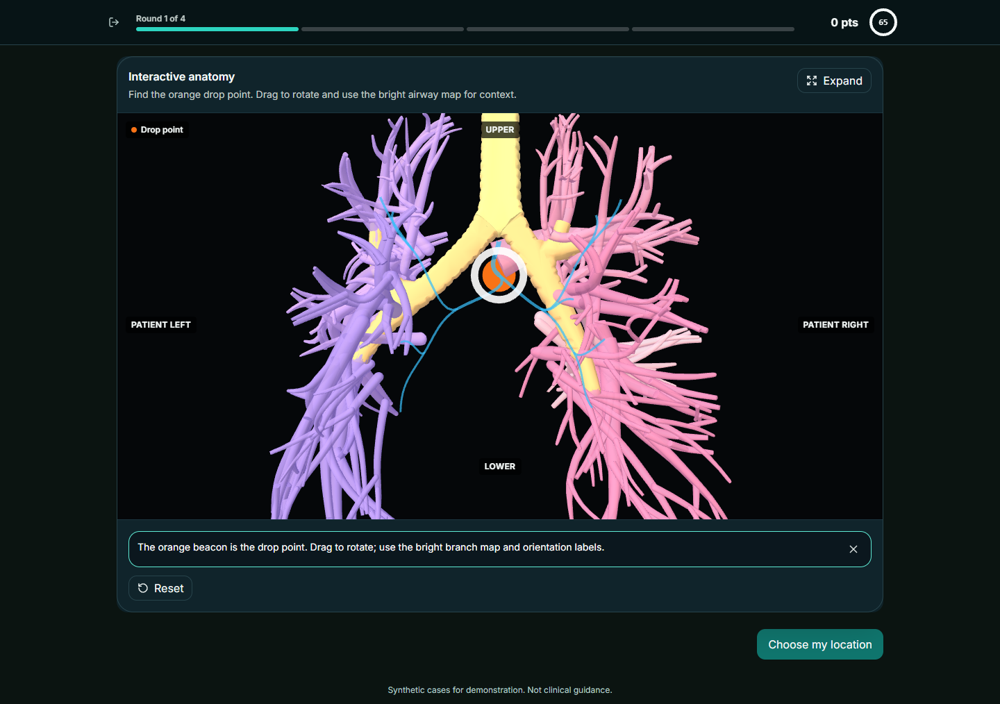
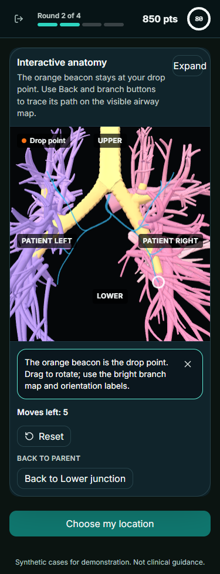
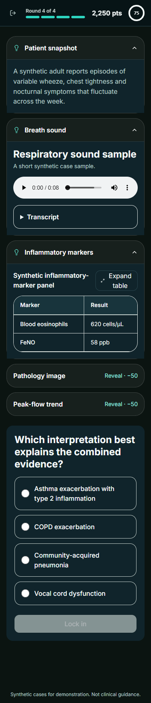

# Quick Challenge participant UX overhaul

**Date:** 2026-10-08  
**Scope:** Respiratory Challenge, all four rounds, desktop 1440 × 900 and touch-phone 375 × 812  
**Status:** Implemented; diagnostic follow-up and final regression evidence are recorded in the
activity log and handoff.

## Method

The challenge was replayed from its normal entry route as a participant rather than inspected only
through component tests. Each round intro, active interaction, answer transition, reveal and final
result was reviewed. The same journey was then replayed in both supported visual-test viewports.

The browser pass checked:

- whether the task could be understood before the clock started;
- whether the target or evidence was perceptible without knowing the authored answer;
- whether controls matched what the scene could actually do;
- whether a wrong, partial, timed-out and correct response produced trustworthy feedback;
- whether result celebrations and presenter reset reflected persisted state correctly.

## Findings and corrections

### QC-01 — Round 1 target was not a usable visual cue

**Severity:** Critical

The original waypoint marker inherited model-scale framing and depth behavior. In the full-lung
overview it could collapse to a near-pixel-sized cue or disappear behind anatomy, so the answer
became a blind classification exercise.

**Correction:** `waypoint_marker` now uses a graph-focused camera, a large depth-independent orange
core, a high-contrast white wireframe halo and a visible branch guide. Patient left/right and
upper/lower labels provide a stable frame of reference. Orbit-only rounds no longer show irrelevant
parent or branch controls.

**Acceptance:** The marker is projected inside the viewport in browser tests and is visibly
distinct in both Round 1 baselines.

### QC-02 — Round 2 was black because the camera was looking beyond the generated airway

**Severity:** Critical

This was not a missing GLB or a failed WebGL render. The round placed the camera at a terminal
waypoint, hid the external model, and looked farther down that branch. Procedural lumen geometry is
built between a waypoint and its children; a terminal waypoint has no child geometry in front of
the camera. The limited look-around range therefore exposed mostly the black scene background.
Follow-up geometry inspection also confirmed that the generated wall triangles were wound inward
while their material rendered `BackSide`, so non-terminal endoscopic views culled the wall and
showed only double-sided rings and findings.

**Correction:** Round 2 now uses an outside-in branch map. The original drop remains an orange
beacon, the airway graph is drawn as bright cyan tubes, movement buttons update a separate current
position marker, and the camera remains outside the model. The lobe and segment response uses
explicit choices instead of requiring an ambiguous mesh pick. The shared lumen generator now also
winds triangles outward, restoring the intended interior wall when other content legitimately uses
endoscopy.

**Acceptance:** The active scene contains no Airway/interior-mode control, the seeded marker is
on-screen, Back and branch controls update movement state, and desktop/phone baselines show the
branch map rather than a black viewport.

### QC-03 — Instructions disappeared before they could be read

**Severity:** High

Round intros advanced after 1.2 seconds. The active timer started with the transition, penalizing a
participant for loading and orienting rather than answering.

**Correction:** Sanofi round intros now remain until the participant selects **Start round**. They
state that the timer has not started. The round-start event and countdown begin only after that
action. The shared component retains configured auto-advance behavior for any other experience
that still requests it.

### QC-04 — Multi-step rounds were over-timed

**Severity:** High

The finding round allowed as little as 30–40 seconds for comparison, zoom, inspection, placement
and submission. The clinical round allowed 50–60 seconds despite an eight-second sound sample,
multiple evidence panels and a diagnosis. Round 2 also combined navigation with a two-step answer.

**Correction:** The final Warm-up / Challenge / Expert limits are:

- Round 1: 65 / 60 / 50 seconds
- Round 2: 80 / 80 / 65 seconds
- Round 3: 55 / 50 / 40 seconds
- Round 4: 75 / 70 / 60 seconds

The configured maximum run window is now five minutes, while the scripted 80%-of-limit rehearsal
still targets two to four minutes.

### QC-05 — First-time guidance could hide the target

**Severity:** High

The anatomy interaction hint was overlaid across the bottom of the canvas, directly covering lower
airway targets and the Lower orientation label.

**Correction:** The hint now renders in the controls panel below/beside the viewport and never
covers anatomy.

### QC-06 — Clinical intro copy contradicted difficulty settings

**Severity:** Medium

The intro claimed that history and sound were the free clues and that optional evidence cost 100
points. Warm-up exposes three free clues at 50 points per paid clue, while Expert exposes one at 150.

**Correction:** The intro now accurately says to review available evidence and decide whether
extra clues are worth their displayed point cost.

### QC-07 — Zero points could be celebrated as a personal best

**Severity:** High

A first completed run with zero points satisfied the old empty-history best condition, emitting
personal-best and possible rank-improvement events. Those events could show the badge and trigger
confetti despite failure.

**Correction:** Both events now require a positive total. A zero run is still recorded, but its
`personalBest` flag is false and it emits no celebratory follow-up.

### QC-08 — Presenter reset left a resumable game behind

**Severity:** High

Resetting learner data did not reliably hydrate and clear the separately persisted game-session
store. Returning to Play could therefore offer a stale **Game in progress**.

**Correction:** Presenter profile actions now rehydrate, clear persisted game-session storage and
clear in-memory sessions. Browser coverage creates an active run, resets, revisits the same URL and
asserts that no resume prompt remains.

### QC-09 — Phone action bars obscured evidence and movement controls

**Severity:** Medium

The fixed primary-action bar could cover Round 2 branch controls and Round 4's inflammatory-marker
table on a 375 × 812 viewport. In the clinical round it was also disabled until a diagnosis was
selected, so the obstruction offered no useful action while the participant was reading.

**Correction:** The spatial **Choose my location** action now follows the anatomy controls in
document flow. The clinical **Lock in** action follows the diagnosis choices. The short image
finding round retains its reachable bottom action because it does not cover evidence.

### QC-10 — Normal answers could schedule the reveal twice

**Severity:** High

The locked-round recovery effect ran whenever a live submission changed the phase to `locked`, not
only when the player was mounted from a persisted locked session. The original submission and the
recovery path could therefore emit two `game_round_answered` events for one answer.

**Correction:** Recovery is armed only when the initial resumed session is already locked. It
replays the persisted submitted, timed-out or skipped path once. Browser coverage now asserts both
an ordinary submission and a restored locked submission produce exactly one answer event.

### QC-11 — Airway movement recreated the WebGL controller

**Severity:** High

The current waypoint was passed back as `startView`, and the viewer hook treated `startView` as a
controller-construction dependency. Each movement could dispose the renderer, reload the model and
reset camera state.

**Correction:** `startView` is initialization state. Live movement continues through
`travelTo`/`setWaypointContext` on the existing controller. A hook regression changes the
endoscopic waypoint and asserts one controller, one model load and no disposal.

## Round 3 and Round 4 usability result

The interaction models themselves were retained:

- Round 3 has a clear specimen image, healthy comparison, zoom controls, keyboard placement and an
  explicit **Lock in location** action. Its principal defect was insufficient inspection time.
- Round 4 keeps the diagnosis choices visible beside evidence on desktop and below evidence on
  phone. Free and paid evidence remains explicit; the intro and timing now match the dynamic
  difficulty configuration.

## Visual evidence

The reviewed screenshots are maintained as Playwright baselines:

- `e2e/sanofi/visual.spec.ts-snapshots/round-intro-*-chromium-win32.png`
- `e2e/sanofi/visual.spec.ts-snapshots/round-one-active-*-chromium-win32.png`
- `e2e/sanofi/visual.spec.ts-snapshots/round-two-active-*-chromium-win32.png`
- `e2e/sanofi/visual.spec.ts-snapshots/round-three-active-*-chromium-win32.png`
- `e2e/sanofi/visual.spec.ts-snapshots/round-four-active-*-chromium-win32.png`
- existing correct/incorrect reveal, result, hub and challenge-landing baselines
- `e2e/phase-13-case-lab.spec.ts-snapshots/03-finding-feedback-desktop-chromium-win32.png`
  proves the corrected shared lumen wall instead of the former ring-only black void

The `*` variants cover desktop Chromium and touch-phone Chromium. These images are regression
evidence, not a substitute for physical-device or clinician usability review.

Representative corrected captures:

## Remaining limitations

- The Round 2 airway is an intentionally simplified spatial guide over the available lung model,
  not a photorealistic continuous bronchoscopy lumen.
- Browser phone emulation does not prove GPU behavior, touch ergonomics or safe-area behavior on a
  physical Android or iPhone.
- Clinical wording and visual interpretation still require clinician/scientific sign-off.
